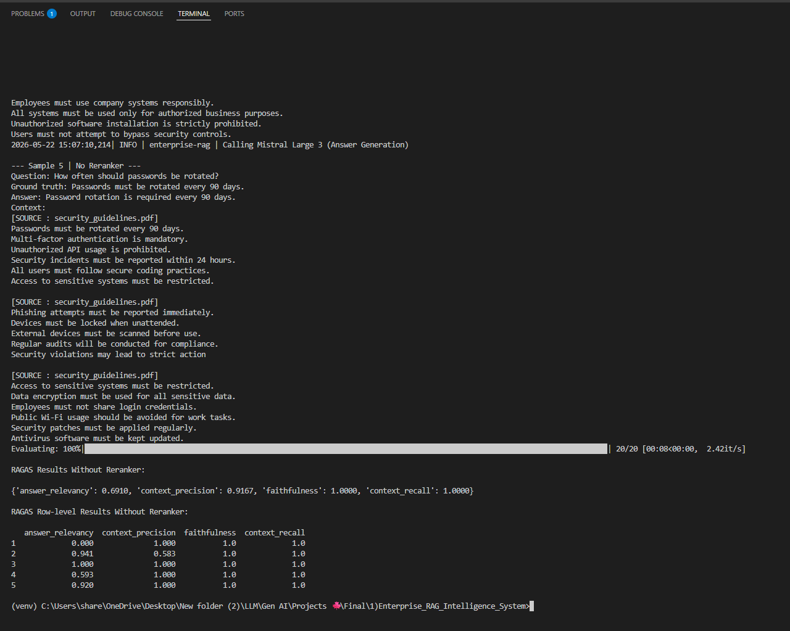
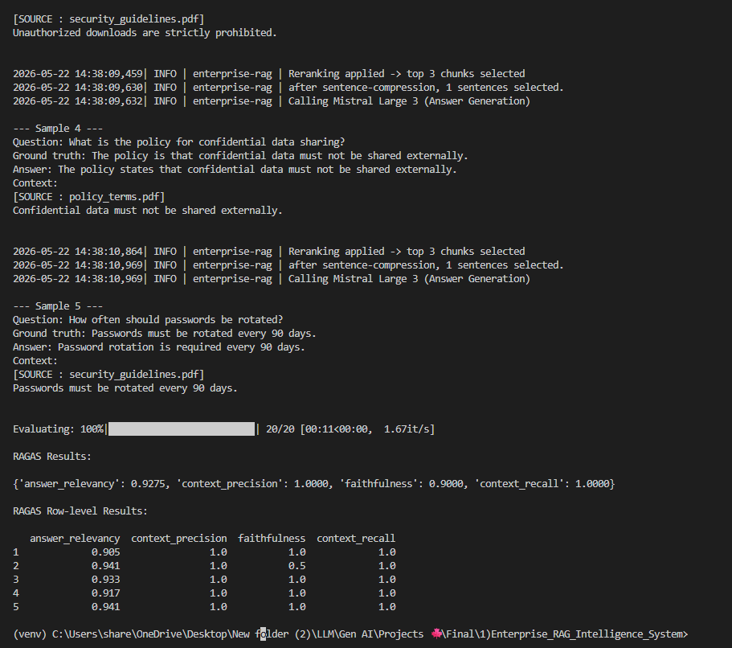
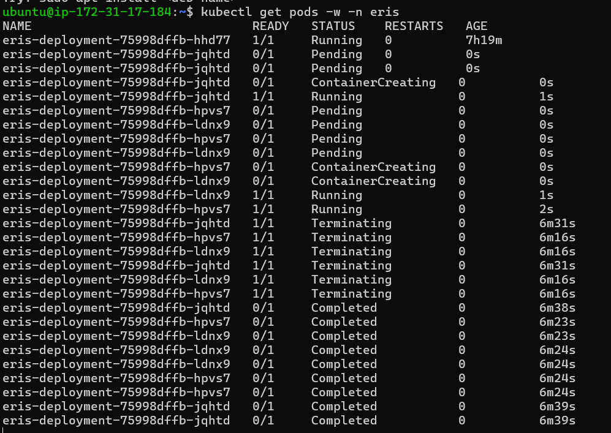
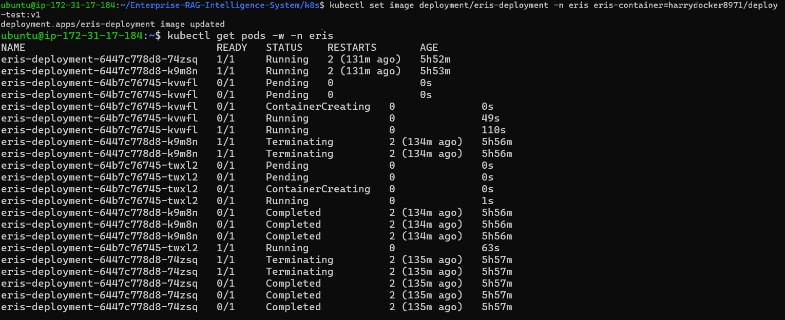

# Project-01-Enterprise RAG Intelligence System

Enterprise RAG Intelligence System is a production-style Retrieval-Augmented Generation project for answering company policy, refund, and security questions using private documents. The system combines FAISS retrieval, AWS Bedrock LLM calls, **query rewriting**, **CrossEncoder reranking**, sentence-level context compression, safety guardrails, chat memory, **RAGAS evaluation**, Docker, **GitHub Actions CI/CD**, and Kubernetes deployment assets.

The project demonstrates both RAG quality improvement and deployment readiness: the pipeline is evaluated before and after **reranking**, containerized with Docker, deployed through GitHub Actions to EC2, and validated with Kubernetes **rolling updates** and **HPA autoscaling** behavior on Minikube.

## Features

- FastAPI backend with `/chat` endpoint and health check
- Streamlit chat UI for local interaction and debugging
- FAISS vector search over enterprise PDF documents
- AWS Bedrock integration for embeddings and answer generation
- Query rewriting for vague or follow-up questions
- CrossEncoder reranking to improve retrieved context quality
- Sentence-level context compression after reranking
- Metadata filtering by document domain
- Safety guardrails for unsafe queries and sensitive context
- PostgreSQL chat memory with session-based conversation history
- RAGAS evaluation for answer and retrieval quality
- Dockerized API service
- GitHub Actions CI/CD pipeline for DockerHub and EC2 deployment
- Kubernetes manifests for namespace, deployment, service, config, and secrets
- Rolling update strategy with readiness and liveness probes
- HPA/autoscaling validation in the EC2 Minikube deployment environment

## Workflow

```text
User / Streamlit / API Client
        |
        v
FastAPI /chat
        |
        +--> Safety check
        |
        +--> Load chat history
        |
        +--> Query rewriting
        |
        +--> Titan embedding
        |
        +--> FAISS retrieval
        |
        +--> Metadata filter
        |
        +--> CrossEncoder reranking
        |
        +--> Sentence-level compression
        |
        +--> Prompt building
        |
        +--> Bedrock LLM answer
        |
        +--> Save chat memory
        |
        v
Answer + sources + session_id
```

## Screenshots

### RAGAS Before Reranking



### RAGAS After Reranking



### Kubernetes HPA Autoscaling



### Rolling Update Validation



## Project Structure

```text
.
|-- main.py                       # FastAPI app, chat endpoint, health check
|-- streamlit_app.py              # Streamlit chat interface
|-- rag.py                        # FAISS retrieval, reranking, compression
|-- ingest.py                     # Document ingestion and FAISS index creation
|-- llmservice.py                 # Bedrock LLM call wrapper
|-- query_rewriter.py             # Standalone query rewriting
|-- prompts.py                    # Prompt construction
|-- safety.py                     # Input guardrails and context sanitization
|-- db.py                         # PostgreSQL chat history persistence
|-- logger.py                     # Shared logging
|-- ragas_eval.py                 # RAGAS evaluation script
|-- rag_api.py                    # Lightweight API entry/helper file
|-- Dockerfile                    # API container definition
|-- requirements.txt              # Python dependencies
|-- .github/
|   `-- workflows/
|       `-- deploy.yml            # DockerHub + EC2 CI/CD pipeline
|-- k8s/
|   |-- namespace.yaml            # Kubernetes namespace
|   |-- deployment.yaml           # Deployment, probes, rolling update strategy
|   |-- service.yaml              # NodePort service
|   |-- configmap.yaml            # Runtime config
|   `-- secret.yaml.example       # Secret template
|-- docs/
|   |-- policy_terms.pdf
|   |-- refund_terms.pdf
|   |-- security_guidelines.pdf
|   |-- api_running.png
|   |-- docker_running.png
|   `-- cicd_pipeline.png
`-- git_screenshots/
    |-- ragas_beforeRR.png
    |-- ragas_afterRR.png
    |-- hpa2.png
    `-- rolling_update.png
```

## How It Works

### Retrieval and Reranking

The retrieval pipeline first embeds the user query with Amazon Titan embeddings and searches the local FAISS index with a higher `k` value for better recall. Retrieved chunks are then reranked with `cross-encoder/ms-marco-MiniLM-L-6-v2`, so the final prompt receives the most relevant evidence instead of only the nearest vector matches.

After chunk reranking, the system performs sentence-level compression. It scores individual sentences against the query, keeps the best supporting lines, and attaches source references. This reduces noisy context before the final answer is generated.

### Query Rewriting and Memory

The system stores chat history by `session_id`. When users ask vague follow-up questions such as "what about that?", the query rewriter converts the message into a standalone retrieval query using recent conversation history. This improves retrieval quality without changing the user's intent.

### Guardrails

The safety layer blocks unsafe user inputs and sanitizes retrieved context if sensitive terms are detected. This keeps the LLM prompt safer and reduces accidental leakage of confidential information.

### Evaluation

`ragas_eval.py` runs a small evaluation set through the same RAG pipeline and evaluates the generated answers with RAGAS metrics such as answer relevancy, context precision, faithfulness, and context recall. The included before/after screenshots show the quality impact of adding reranking.

### Deployment

The app is containerized with Docker and served with Uvicorn. The GitHub Actions workflow builds a versioned Docker image, pushes it to DockerHub, connects to EC2 over SSH, pulls the new image, and restarts the running container.

The `k8s/` folder contains Kubernetes manifests for running the service in a Minikube/Kubernetes environment. The deployment uses two replicas, readiness and liveness probes, and a rolling update strategy with `maxUnavailable: 0` and `maxSurge: 1` for zero-downtime style rollout validation.

## Setup

Clone the repository:

```bash
git clone <your-repo-url>
cd Enterprise_RAG_Intelligence_System
```

Create and activate a virtual environment:

```bash
python -m venv venv
venv\Scripts\activate
```

Install dependencies:

```bash
pip install -r requirements.txt
```

Create a `.env` file:

```env
AWS_ACCESS_KEY_ID=your_aws_access_key
AWS_SECRET_ACCESS_KEY=your_aws_secret_key
AWS_DEFAULT_REGION=us-east-1
DB_url=your_postgresql_connection_string
OPENAI_API_KEY=your_openai_key_for_ragas
LANGCHAIN_API_KEY=your_langsmith_key
LANGCHAIN_TRACING_V2=true
LANGCHAIN_PROJECT=ERIS
```

If the FAISS index is not already present, the API startup path can trigger ingestion automatically. You can also create it manually:

```bash
python ingest.py
```

## Run Locally

Start the FastAPI backend:

```bash
uvicorn main:app --reload
```

Open the API health check:

```text
http://localhost:8000/
```

Send a chat request:

```bash
curl -X POST http://localhost:8000/chat ^
  -H "Content-Type: application/json" ^
  -d "{\"query\":\"What is the refund processing time?\",\"domain\":\"refund_terms\"}"
```

Run the Streamlit app:

```bash
streamlit run streamlit_app.py
```

## Run RAGAS Evaluation

```bash
python ragas_eval.py
```

This evaluates the RAG pipeline on sample questions and prints row-level RAGAS metrics.

## Docker

Build the image:

```bash
docker build -t eris .
```

Run the container:

```bash
docker run -d --name eris-container --env-file .env -p 8000:8000 eris
```

## Kubernetes

Apply the manifests:

```bash
kubectl apply -f k8s/namespace.yaml
kubectl apply -f k8s/configmap.yaml
kubectl apply -f k8s/secret.yaml
kubectl apply -f k8s/deployment.yaml
kubectl apply -f k8s/service.yaml
```

Check rollout status:

```bash
kubectl rollout status deployment/eris-deployment -n eris
```

Access the NodePort service:

```text
http://<node-ip>:30007
```

## CI/CD

The GitHub Actions workflow in `.github/workflows/deploy.yml` runs on pushes to `main` and performs:

- checkout
- DockerHub login
- Docker image build with a version tag and `latest`
- image push to DockerHub
- SSH deployment to EC2
- old container cleanup
- new container startup with the EC2 `.env` file

Required GitHub secrets:

- `DOCKER_USERNAME`
- `DOCKER_PASSWORD`
- `EC2_HOST`
- `EC2_USER`
- `EC2_SSH_KEY`

## Tech Stack

- Python
- FastAPI
- Streamlit
- LangChain
- FAISS
- AWS Bedrock
- Amazon Titan Embeddings
- CrossEncoder reranking
- PostgreSQL
- RAGAS
- OpenAI API for evaluation
- Docker
- GitHub Actions
- AWS EC2
- Kubernetes / Minikube

## Future Upgrades

- Hybrid search: combine dense vector retrieval with keyword/BM25 search to improve recall for exact policy terms and semantic questions.
- Terraform: provision EC2, networking, security groups, and deployment infrastructure as reusable Infrastructure as Code.
- Jenkins + AWS workflow: extend CI/CD with Jenkins pipelines and AWS services such as S3 and Lambda for artifact storage, automation, and event-driven deployment steps.

## Note

This project is for learning and demonstration. Keep `.env`, virtual environments, generated indexes, secrets, and private API keys out of GitHub.
